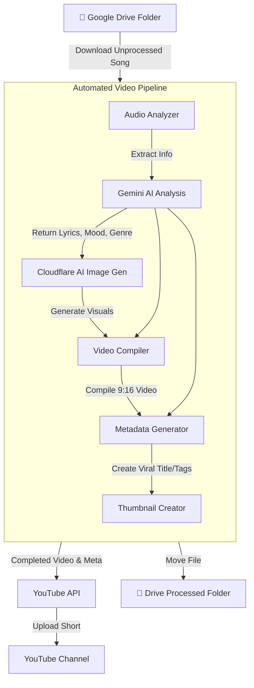

Based on the codebase provided, here is a breakdown of what the application does and how to set it up.

### What This App Does

This application is an automated **YouTube Shorts Creator**. It listens for songs in a designated Google Drive folder and orchestrates an AI-powered pipeline to turn those songs into engaging visualizer videos and automatically uploads them to YouTube as Shorts. 

Here is what happens during its automated pipeline for a single song:
1. **Audio Download:** Retrieves an unprocessed song from a specific Google Drive folder.
2. **Analysis:** Uses Google's Gemini AI to analyze the song, deducing its metadata, lyrics, artist, genre, and mood.
3. **Image Generation:** Calls Cloudflare AI (Nano Banana 2) to generate dynamic, lyrics-based background images that match the mood of the song.
4. **Video Compilation:** Compiles the generated images, audio, and animated lyrics into a 9:16 vertical video optimized for YouTube Shorts.
5. **Metadata & Thumbnails:** Uses the AI's analysis to generate viral metadata (titles, descriptions, tags) and creates a thumbnail.
6. **Upload:** Automatically uploads the finished Short to YouTube using your authenticated channel.
7. **Cleanup:** Moves the original audio file into a "Processed" folder in Google Drive so it doesn't get processed again.

### Workflow Diagram



***

### Step-by-Step Setup Guide

You can run this application locally or deploy it to run automatically using GitHub Actions.

#### 1. Local Setup
1. **Install Dependencies:** Open a terminal in the project directory and run:
   ```bash
   pip install -r requirements.txt
   ```
   *(Note: You will also need to have `FFmpeg` installed on your system's PATH for the video compilation step to work).*
2. **Environment Variables:** Rename `.env.example` to `.env`. Fill in standard settings like `WATERMARK_TEXT`, `CHANNEL_NAME`, video duration defaults, etc.
3. **Google Cloud Credentials:**
   - Go to the [Google Cloud Console](https://console.cloud.google.com/) and create a project.
   - Enable the **YouTube Data API v3** and the **Google Drive API**.
   - Create OAuth 2.0 credentials specifically for a "Desktop app".
   - Download the credentials file and rename it to `client_secret.json`, placing it in a folder called `credentials` (if the directory doesn't exist, create it).
4. **First-Time Authentication:**
   Run the app locally for the first time by executing:
   ```bash
   python main.py
   ```
   This will prompt you to log into Google in your browser to give the app permissions. Upon success, it will create a `token.json` file. Now you are authenticated!

#### 2. Service Credentials
To make the pipeline work perfectly, you need adequate environment keys in your `.env` file (or GitHub Variables):
- **Google Drive IDs:** Pass your `DRIVE_FOLDER_ID` (where you upload your raw `.mp3` files) and `DRIVE_PROCESSED_FOLDER_ID` (where they move after completion).
- **Gemini API:** Supply a `GEMINI_API_KEY` for fetching the lyrics and mood data.
- **Cloudflare API (nano-banana):** Feed in the `CLOUDFLARE_ACCOUNT_ID` and `CLOUDFLARE_API_TOKEN` so it can render the background images.

#### 3. GitHub Actions Setup (For Full Automation)
If you want to run this in the cloud on a schedule without keeping your PC on:
1. Go to your GitHub Repository -> Settings -> Secrets and variables -> Actions.
2. Add the following repository secrets:
   - `GEMINI_API_KEY`
   - `CLOUDFLARE_ACCOUNT_ID`
   - `CLOUDFLARE_API_TOKEN`
   - `DRIVE_FOLDER_ID`
   - `DRIVE_PROCESSED_FOLDER_ID`
   - `YOUTUBE_CLIENT_SECRET` (Paste the exact text contents of your `client_secret.json`)
   - `YOUTUBE_TOKEN` (Paste the exact text contents of your `token.json` that was generated in Step 1)
3. The `.github/workflows/auto-upload.yml` will now execute automatically every morning at 6:00 AM UTC and evening at 6:00 PM UTC to process songs from the Drive folder.

### Useful CLI Commands
You don't always have to automate the pipeline. You can use local CLI arguments while developing:
- `python main.py --list`: Lists available unprocessed songs in your Google Drive.
- `python main.py --local "path_to_song.mp3"`: Tests the system out locally offline using a song on your hard drive.
- `python main.py --no-upload`: Allows the pipeline to generate the MP4 video, title, and thumbnails but prevents it from actually uploading to Youtube.
